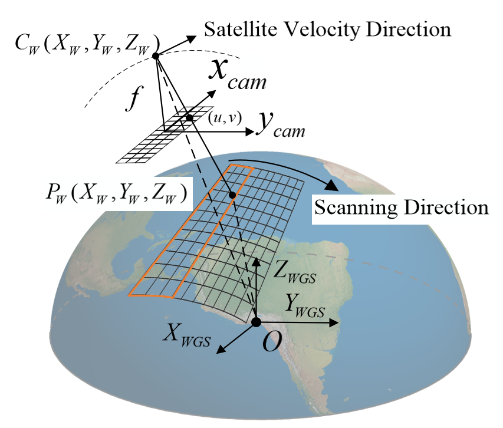
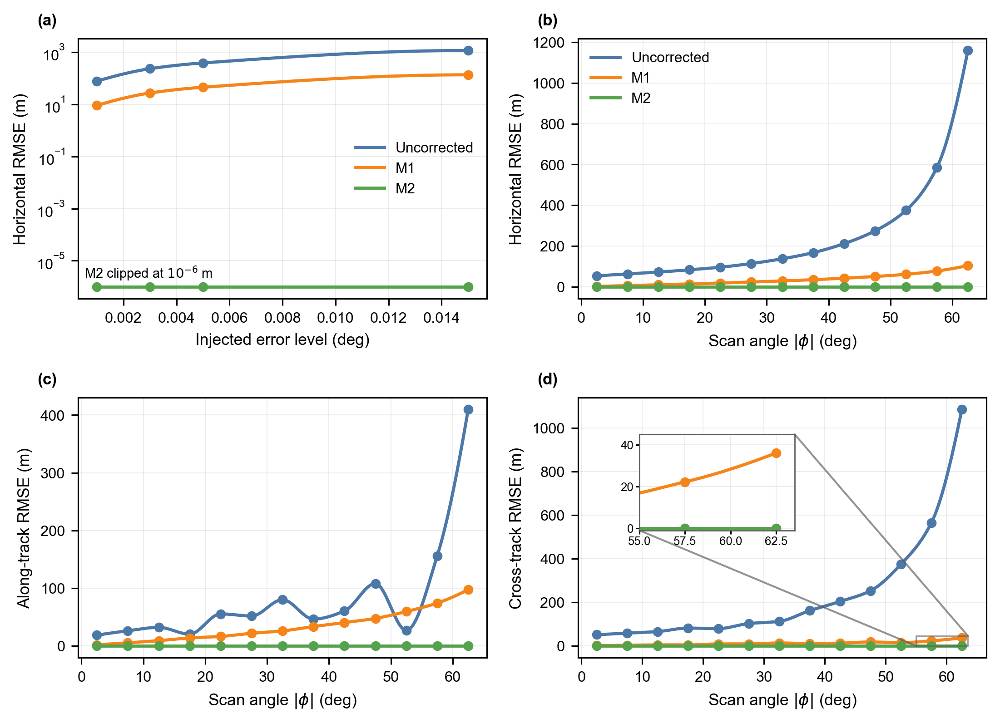

# Geometric Error Modeling and Compensation for Rotating Scan Remote Sensing Satellites

> A visual project page for a manuscript on mechanism-aware geometric positioning and compensation for rotating-scan remote sensing satellites.

**Project status:** Manuscript in preparation for submission.

## Rotating-scan concept and error sources

  

A rotating payload extends cross-track observation coverage, but its additional motion introduces geometric effects that are absent from conventional fixed-payload imaging. This study explicitly represents two mechanism-specific error sources: the scan-angle error and the two directional components of rotation-axis tilt.

## Rigorous imaging geometry

  

The rigorous model establishes the physical mapping from detector coordinates to the ground intersection through synchronized satellite and payload geometry. It provides the common basis for error modeling, control-point parameter estimation, positioning, and image geometric correction.

## Scan-angle-dependent imaging

  

Basemap imagery: © Esri and its data providers. Simulation, artificial targets, and annotations: © The Authors.

Simulated observations of the Baotou calibration field illustrate the variation in target appearance and ground sampling distance (GSD) across the scan-angle range. Large-angle observations exhibit stronger oblique-view deformation and coarser ground sampling, motivating angle-aware observation modeling.

## Compensation framework

The study follows a unified error-modeling and correction chain:

1. mechanism-specific errors are introduced into the rotating-scan imaging geometry;
2. compensation parameters are estimated from ground control points distributed over multiple scan angles;
3. the estimated parameters are fed back into positioning and geometric-correction models;
4. independent check points and non-target image regions are used to evaluate absolute and relative geometric accuracy.

The first compensation model represents low-order scan-angle error. The extended model additionally represents rotation-axis tilt, while GSD-aware weighted estimation accounts for the spatially varying uncertainty of image observations.

## Selected quantitative evidence

  

The results show that scan-angle compensation removes the dominant positioning error, whereas explicit rotation-axis modeling further suppresses the structured residuals, particularly in the large-angle region.

## Main findings

- Rotating-mechanism errors exhibit clear scan-angle-dependent amplification.
- Rotation-axis tilt leaves a directional residual that cannot be fully represented by a scan-angle-only model.
- The anisotropic GSD variation affects control-point observation uncertainty and motivates weighted estimation.
- The estimated parameters improve both point-wise positioning and local image-level geometric consistency.

Additional visual evidence is available in the [technical results overview](docs/technical_results.md), and figure provenance is summarized in the [figure index](docs/figure_index.md).

## Code and data availability

This repository serves as a project page for a manuscript currently being prepared for submission. At this stage, it provides only a high-level description of the work and selected visualizations.

Source code, detailed experimental configurations, auxiliary data, and full-resolution simulation imagery are not included during manuscript preparation and peer review. Subject to journal policy and institutional, coauthor, intellectual-property, third-party-data, and legal approvals, the authors intend to release the reproducibility materials after acceptance or publication. The final release scope and license will be stated here.

Citation information will be added upon publication.

## Rights and reuse

The current project-page materials are provided for scholarly communication only. See [NOTICE.md](NOTICE.md) for the applicable terms. Separate licenses may be provided for source code and data in a later reproducibility release.
