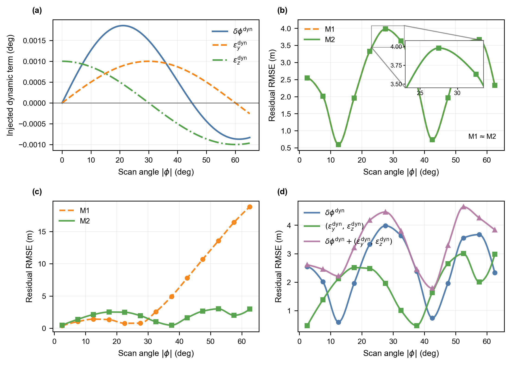
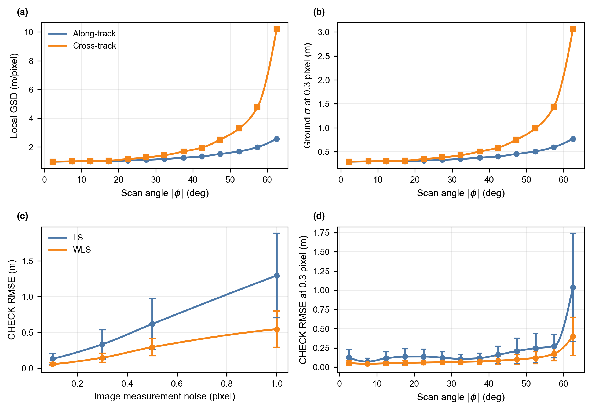
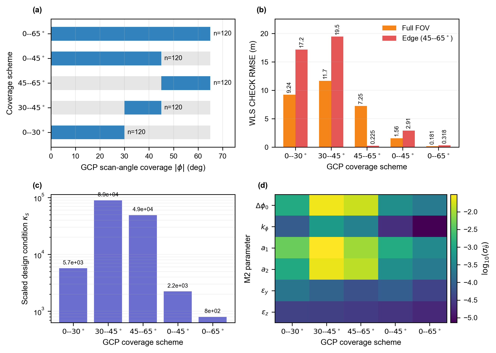
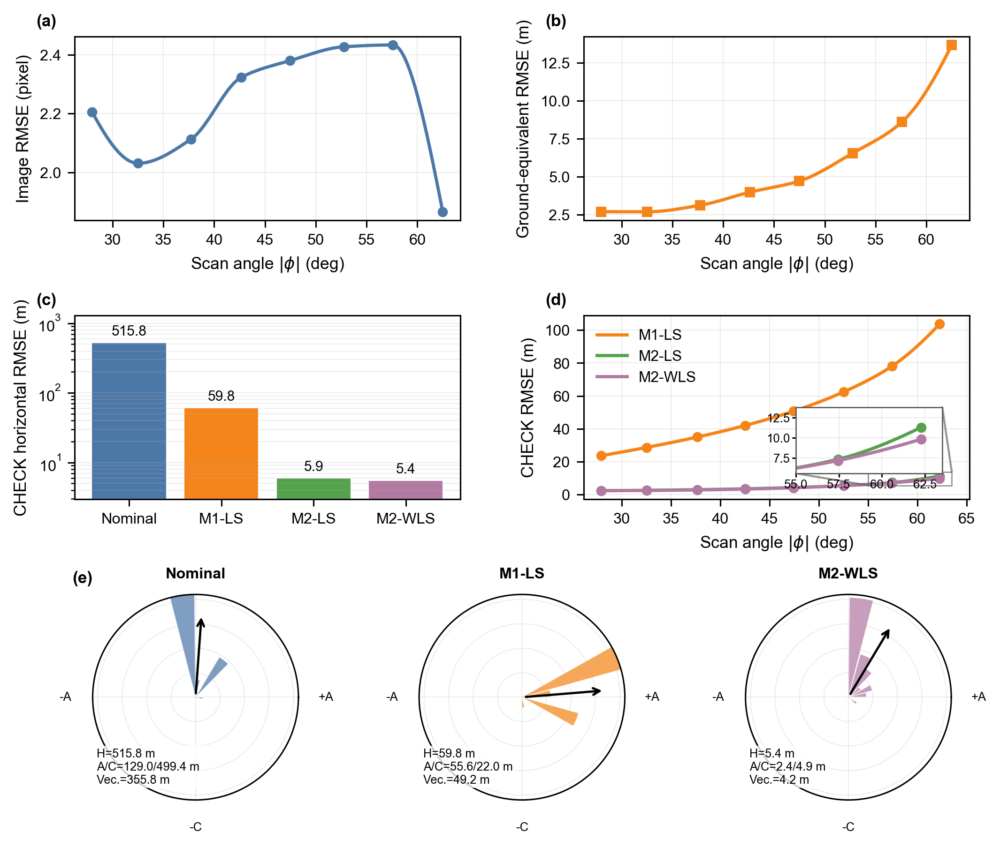
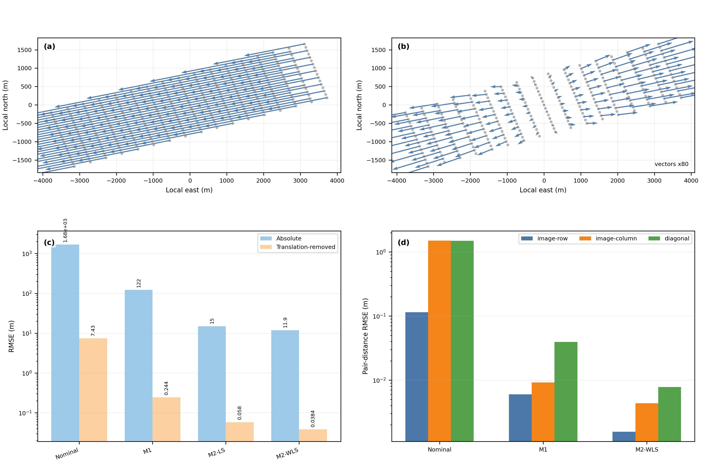

# Technical results overview

The project homepage emphasizes the imaging concept and visual experiment design. This page collects additional quantitative evidence without releasing the underlying data or experimental configuration.

## Unmodeled dynamic error

The residual response characterizes the applicability boundary of the low-order compensation model under higher-frequency disturbances.

## GSD-aware weighted estimation

The figure connects anisotropic GSD growth with observation weighting and positioning-error propagation.

## GCP angular coverage and observability

The results show how scan-angle coverage affects parameter conditioning and estimation stability.

## Image-level closed-loop accuracy

Independent check-point evaluation assesses the compensation parameters estimated from image observations.

## Local relative geometric distortion

The analysis separates overall geolocation displacement from translation-removed local distortion and directional distance-preservation errors.

